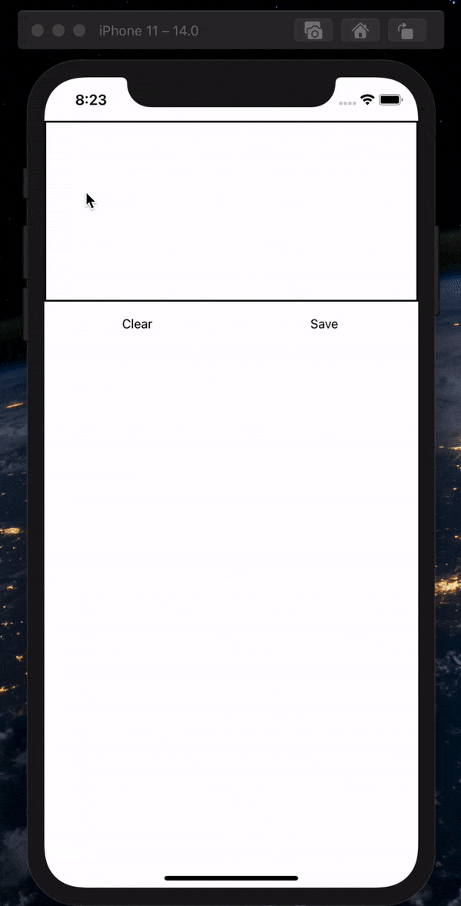
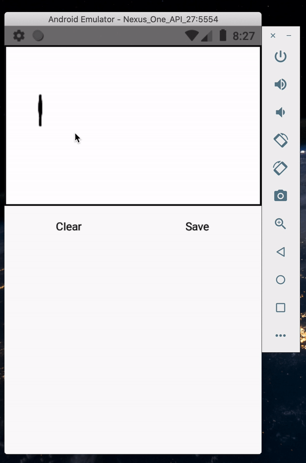

# React-Native-Signature-Capture-View

#### Capture signatures in react native

A webview wrapper over [signature_pad.js](https://github.com/szimek/signature_pad). This is fully javascript based component so no linking is required.

  [](http://makeapullrequest.com)

Made this component for a client project. Decided to open source it since its already internally using [signature_pad.js](https://github.com/szimek/signature_pad)


##### Screenshots

 


 

  


##### Snack
<div data-snack-id="@khattakahmed/react-native-signature-capture-view" data-snack-platform="ios" data-snack-preview="true" data-snack-theme="dark" style="overflow:hidden;background:#212121;border:1px solid var(--color-border);border-radius:4px;height:505px;width:100%"></div>
<script async src="https://snack.expo.io/embed.js"></script>


##### Important
Requires peer dependency with [react-native-webview](https://www.npmjs.com/package/react-native-webview) install with `npm i react-native-webview`


##### Installation
`npm i react-native-signature-capture-view`


##### Usage

Take a look in the examples folder as well.

```import React, {useRef, useState} from 'react';
import {SafeAreaView, StatusBar, TouchableOpacity, Text, ScrollView, View} from 'react-native';
import {SignatureView} from 'react-native-signature-capture-view';

const App = () => {
  const signatureRef = useRef(null);
  const [text,setText] = useState('')
  return (
    <>
      <StatusBar barStyle="dark-content" />
      <SafeAreaView style={{ flex: 1}}>
        <SignatureView
        style={{
          borderWidth:2,
          height:200,
        }}
        
          ref={signatureRef}
          // onSave is automatically called whenever signature-pad onEnd is called and saveSignature is called
          onSave={(val) => {
            //  a base64 encoded image
            console.log('saved signature')
            console.log(val);
            setText(val)
           
          }}
          onClear={() => {
            console.log('cleared signature')
            setText('')
          }}
        />
        <View style={{flexDirection: 'row', justifyContent:'center', height: 50}}>
        <TouchableOpacity
        style={{ justifyContent:'center',alignItems:'center', flex:1}}
          onPress={() => {
            signatureRef.current.clearSignature();
          }}>
          <Text>Clear</Text>
        </TouchableOpacity>
        <TouchableOpacity
         style={{ justifyContent:'center',alignItems:'center', flex:1}}
          onPress={() => {
            signatureRef.current.saveSignature();
          }}>
          <Text>Save</Text>
        </TouchableOpacity>
        </View>
       
        <ScrollView style={{flex:1,margin: 20}}>
          <Text numberOfLines={10} ellipsizeMode='tail'>{text}</Text>
        </ScrollView>
      </SafeAreaView>
    </>
  );
};

export default App;


